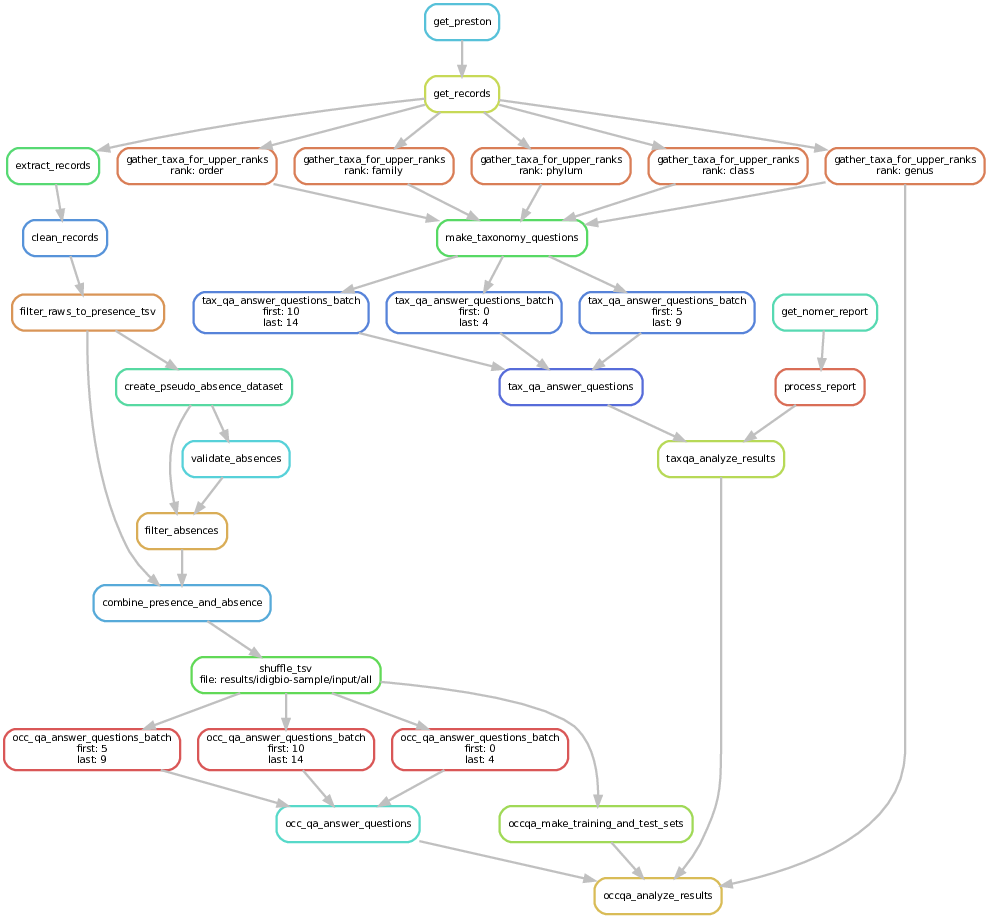

## Workflow execution examples

Install [mamba](https://github.com/conda-forge/miniforge#install) or similar.

Activate a [snakemake](https://snakemake.readthedocs.io/en/stable/getting_started/installation.html) environment:

```bash
mamba create -n snakemake --file environment.yml
mamba activate snakemake
```

* Run taxonomy QA for GPT-3.5:

```bash
snakemake "results/idigbio-sample/gpt-3.5-turbo-0125/taxonomy/responses.tsv" --sdm "conda" -c 8 --configfile "config/idigbio-sample/gpt-3.5-turbo-0125.yml"
```

* Run US counties occurrence questions for GPT-4

```bash
snakemake "results/us-maps/gpt-4-1106-preview/occurrence/responses.tsv" --sdm "conda" -c 8 --configfile "config/us-maps/gpt-4-1106-preview.yml"
```

## Create process figures

```bash
snakemake "results/idigbio-sample/gpt-3.5-turbo-0125/occurrence/responses.tsv" \
--sdm "conda" --configfile "config/idigbio-sample/gpt-test.yml" \
--forceall --dag \
| dot -Tpdf > docs/processes/idigbio-sample-occqa.pdf
```

```bash
snakemake "results/idigbio-sample/gpt-3.5-turbo-0125/taxonomy/responses.tsv" \
--sdm "conda" --configfile "config/idigbio-sample/gpt-test.yml" \
--forceall --dag \
| dot -Tpdf > docs/processes/idigbio-sample-taxqa.pdf
```

```bash
snakemake "results/idigbio-sample/gpt-3.5-turbo-0125/process-occ-gpt.py.ipynb" \
--sdm "conda" --configfile "config/idigbio-sample/gpt-test.yml" \
--forceall --dag \
| dot -Tpdf > docs/processes/idigbio-sample-results.pdf
```

The generated PDFs are [here](docs/idigbio-sample/).

Here's the full process DAG:



## Future work

* Improve taxonomy QA
    * Questions should probably specify the kingdom, as names can be reused across kingdoms
    * Fungi sets are currently unusable for various reasons
    * Names that nomer failed to align:
        * Athrostichtus
        * Bombus pyrobombus
        * Bombus subterraneobombus
        * Eucera xenoglossa
        * Indet
        * Melissodes eumelissodes
        * Ophiocrosota
        * Phyllocaenia
        * Towndsendia
        * X serapicamptis
        * scientificName
